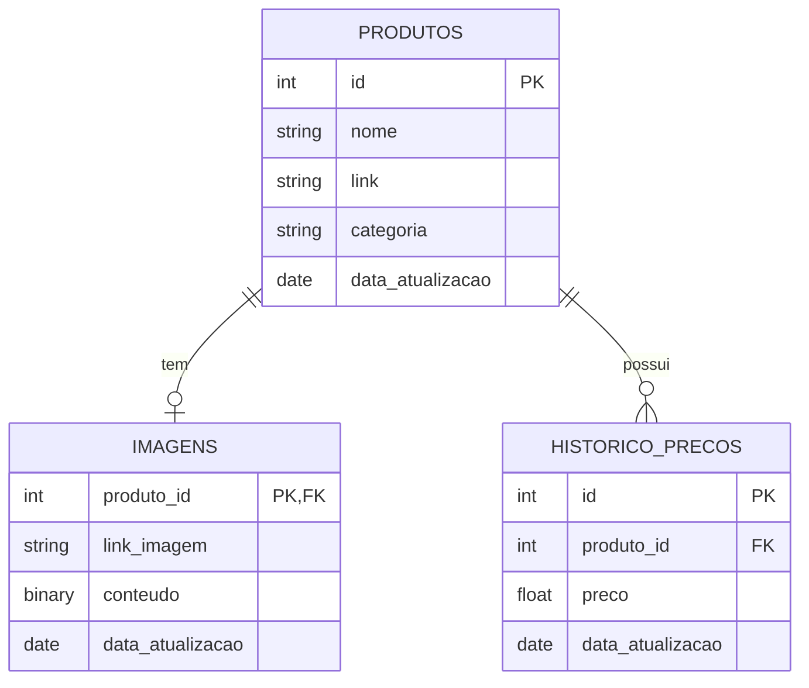

# Web Scraping Supermercado Irmãos Gonçalves

## Índice
1.  [Descrição](#descrição)
2.  [Funcionalidades](#funcionalidades)
3.  [Tecnologias Utilizadas](#tecnologias-utilizadas)
4.  [Pré-requisitos](#pré-requisitos)
5.  [Instalação](#instalação)
6.  [Estrutura do Projeto](#estrutura-do-projeto)
7.  [Diagrama ER](#diagrama-er)
8.  [Como Usar](#como-usar)
9.  [Tempo Médio de Execução](#tempo-médio-de-execução)
10. [Análise de Dados](#análise-de-dados)
11. [Visualização de Dados](#visualização-de-dados)
12. [Licença](#licença)

## Descrição

Este projeto realiza web scraping assíncrono do site do maior supermercado de Rondônia, [Irmãos Gonçalves](https://www.irmaosgoncalves.com.br/), extraindo informações de produtos como nome, preço, link do produto e sua imagem correspondente. Atualmente, o site contém aproximadamente 18.000 produtos. Os dados são armazenados em um banco de dados PostgreSQL usando SQLAlchemy para futura análise.

## Funcionalidades

- Web scraping assíncrono do site do Irmãos Gonçalves usando asyncio e aiohttp
- Extração de nome, preço e link dos produtos, link das imagens e a categoria que o produto pertence
- Armazenamento dos dados em banco de dados PostgreSQL usando SQLAlchemy
- Download de imagens dos produtos
- Seleção de cidade para coleta de dados
- Processamento automatizado através do script principal

## Tecnologias Utilizadas

- **asyncio**: Para operações assíncronas e melhoria de performance
- **aiohttp**: Para requisições HTTP assíncronas
- **BeautifulSoup**: Para parsing de HTML
- **SQLAlchemy**: Para ORM e operações de banco de dados
- **PostgreSQL**: Para armazenamento dos dados
- **SQLite**: Como banco de dados para testes
- **Selenium**: Para a extração do link das imagens

## Pré-requisitos

- Python 3.12+
- Navegador web compatível com Selenium (ex: Chrome, Firefox)

## Instalação

1.  Clone o repositório:

    ```bash
    git clone https://github.com/AndreLuis933/irmaos-goncalves-scraper
    cd irmaos-goncalves-scraper
    ```

2.  Crie e ative um ambiente virtual:

    ```bash
    python -m venv venv
    source venv/bin/activate  # Linux/MacOS
    venv\\Scripts\\activate     # Windows
    ```

3.  Instale as dependências:
    ```bash
    pip install -r requirements.txt
    ```

## Estrutura do Projeto

```
IRMAOS-GONCALVES-SCRAPER/
│
├── database/
│   ├── __init__.py
│   ├── db_operations.py
│   └── db_setup.py
│
├── scraper/
│   ├── images/
│   │   ├── download.py
│   │   ├── get_link.py
│   │   ├── get_links.py
│   │   └── prever_imagens.py
│   │
│   ├── utils/
│   │   └── request_async.py
│   │
│   └── baixar_site.py
│
├── .env
├── .gitignore
├── LICENSE
├── cookies.json
├── ProdutosIG.db # se for usar Banco de dados SQLite
├── README.md
├── main.py
├── requirements.txt
└── selecionar_regiao.py
```

## Diagrama ER



## Como Usar

1.  Se desejar selecionar a região, execute este script e escolha a cidade desejada:
    ```bash
    python selecionar_regiao.py
    ```
2.  Vá no arquivo db_setup.py e execulte ele para criar as tabelas no banco de dados, se for usar postegres defina a url de conexão no arquivo de variaves de ambiente.

3.  Após selecionar a região e o banco de dados, execute o script principal:
    ```bash
    python main.py
    ```

## Tempo Médio de Execução

A tabela abaixo resume os tempos médios de execução das principais tarefas do script. Os tempos são aproximados e podem variar dependendo das condições da rede e do servidor.

| Tarefa                                 | Tempo Médio | Descrição                                                                                                                                 |
| -------------------------------------- | ----------- | ----------------------------------------------------------------------------------------------------------------------------------------- |
| Preços dos produtos sem categoria      | 60 segundos | Tempo para coletar os preços dos produtos sem a categoria junto.                                                                          |
| Preços dos produtos com categoria      | 5 minutos   | Tempo para coletar os preços dos produtos com as categorias.                                                                              |
| Extração dos links das imagens         | 20 minutos  | Tempo necessário para extrair os links das imagens dos produtos, utilizando Selenium.                                                     |
| Download das imagens                   | 60 segundos | Tempo para baixar as imagens dos produtos. Pode variar dependendo do tamanho das imagens e da velocidade da conexão.                      |
| Extração de links faltantes (por link) | 20 segundos | Tempo para extrair links que possam ter falhado na primeira tentativa. Este processo é executado individualmente para cada link faltante. |

## Análise de Dados

O projeto inclui uma análise estatística detalhada dos dados coletados, focando na variação de preços por categoria ao longo do tempo.

### Metodologia de Análise

A análise foi implementada utilizando Python com as bibliotecas pandas e numpy, seguindo estas etapas:

1. **Extração de Dados**: Consulta SQL para obter produtos, categorias e histórico de preços do banco PostgreSQL
2. **Processamento de Categorias**: Extração de diferentes níveis hierárquicos das categorias (do mais genérico ao mais específico)
3. **Cálculo de Variações**:
   - **Variação Percentual Diária**: Calculada para produtos com registros em dias consecutivos
   - **Variação Percentual Acumulada**: Obtida através do produto cumulativo dos fatores de variação diária

### Métricas Calculadas

- **Preço Médio por Categoria**: Média dos preços dos produtos em cada categoria
- **Variação Percentual Diária**: Média das variações de preço de um dia para o outro
- **Variação Percentual Acumulada**: Efeito composto das variações diárias ao longo do tempo
- **Médias Comparativas**:
  - **Média Simples**: Média aritmética das variações entre todas as categorias
  - **Média Ponderada**: Média ponderada pela quantidade de produtos em cada categoria

### Funcionalidades Analíticas

A análise permite:

- Selecionar o nível hierárquico das categorias (do mais genérico ao mais específico)
- Filtrar categorias específicas para análise comparativa
- Agrupar dados por data e categoria para identificar tendências temporais

### Aplicações Práticas

Esta análise estatística pode ser utilizada para:

- Prever tendências futuras de preços
- Identificar categorias com maior inflação ou deflação
- Otimizar decisões de compra baseadas em padrões históricos
- Comparar o comportamento de preços entre diferentes categorias de produtos

## Visualização de Dados

Os dados analisados são visualizados através de gráficos que permitem comparar a variação percentual acumulada entre diferentes categorias de produtos ao longo do tempo.

### Gráficos de Variação Percentual Acumulada

Utilizando a biblioteca Matplotlib, o projeto inclui funcionalidades para gerar gráficos comparativos que mostram como os preços evoluíram em relação ao primeiro dia de coleta:

```python
# Exemplo de uso da função de visualização
categorias = [
    \"Media Ponderada\",
    \"Media Simples\",
    \"açougue\",
]

grafico_categorias(df_variacao, categorias)
```

### Características dos Gráficos

- **Comparação Multi-categoria**: Visualização simultânea da evolução de preços de diferentes categorias
- **Métricas de Referência**: Médias simples e ponderadas para comparação com categorias específicas
- **Formatação Temporal**: Datas formatadas adequadamente no eixo X para melhor legibilidade
- **Anotações Automáticas**: Para visualizações com poucas categorias (≤3), valores percentuais anotados nos pontos do gráfico
- **Personalização Visual**: Cores distintas para cada categoria e elementos visuais como linhas de grade e referência zero

### Interpretação dos Resultados

Os gráficos gerados permitem identificar visualmente:

- Categorias com inflação ou deflação mais acentuada
- Períodos de maior volatilidade nos preços
- Divergências entre categorias específicas e as médias gerais
- Tendências de longo prazo no comportamento dos preços

Esta visualização complementa a análise estatística, oferecendo uma forma intuitiva de compreender os padrões de variação de preços por categoria ao longo do tempo.

## Licença

Este projeto está licenciado sob a Licença MIT - veja o arquivo [LICENSE](LICENSE) para detalhes.
